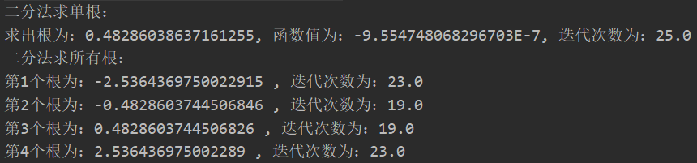
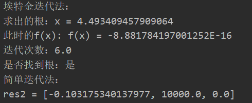
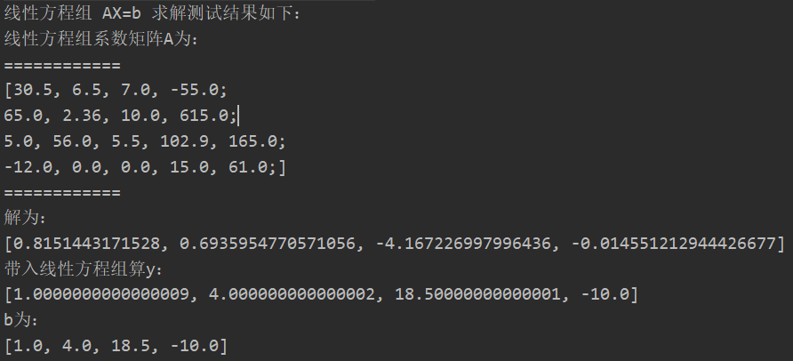

# 数值计算方法

### 第一章：

误差估计等，略

### 第二章：

1、二分法求单根以多根

​	Dichotomy.java

2、简单迭代法求单根，埃特金加速法求单根

​	SimpleIteration.java

3、牛顿迭代法求单根（用弦截法实现）	

​	NewtonIteration.java

### 第三章：

1、矩阵工具箱 

​    实现了求矩阵的行列式、求矩阵的逆、矩阵转置（通过对数器测试）

​	MatrixUtils.java、TestDet.java（测试类）

2、消元法求解线性方程组

​	高斯全主元消元法求解线性方程组

​	EliminationMethod.java、TestEliminationMethod.java（测试消元法类）

未完待续...